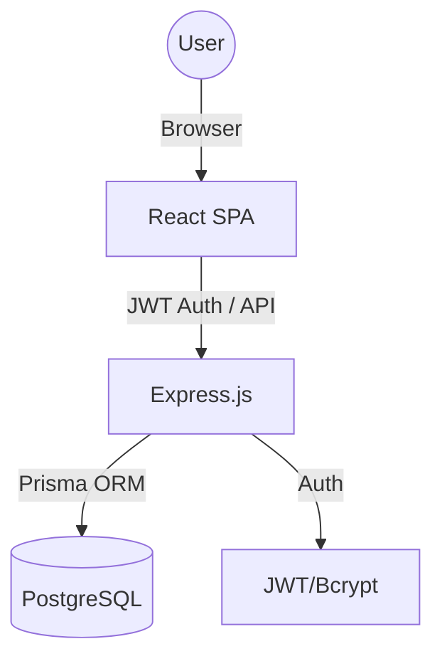
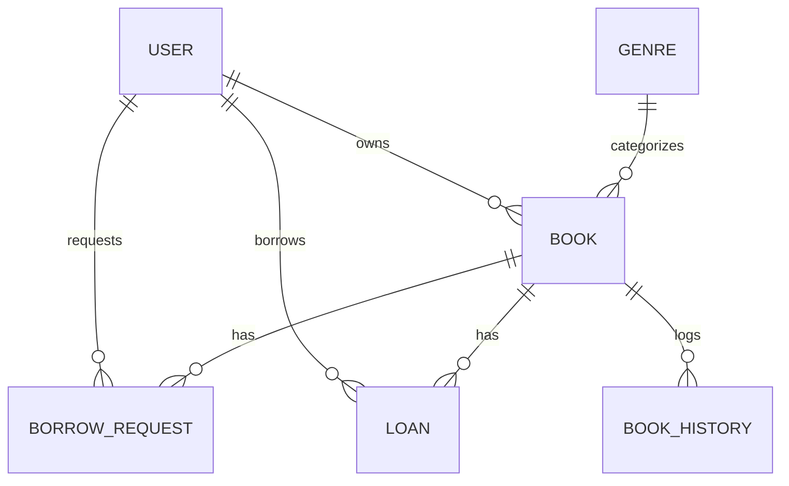

# BookNook Project Context

## 1. Project Overview

*   **Project Name:** BookNook
*   **Mission:** To foster a reading community through a peer-to-peer library system.
*   **Problem Solved:** Traditional libraries are limited by location and inventory; BookNook enables individuals to share their personal collections within their community/team.
*   **Target Users:** Teams, office communities, and social reading circles.
*   **Core Value Proposition:** Easy book discovery, managed borrowing workflows, and transparent history tracking for community-owned books.
*   **Current Project Status:** Migrated from Spring Boot to Node.js/Express. Functional prototype with core borrowing logic and discovery features.
*   **Success Metrics:** Number of books listed, borrow request conversion rate, and active user engagement on the history timeline.

---

## 2. Product Vision

*   **Long-term Vision:** Become the standard platform for localized, high-trust sharing economies starting with books.
*   **Key Objectives:** 
    *   Provide a seamless request-to-loan experience.
    *   Maintain high data integrity through transactional state management.
    *   Ensure mobile-first accessibility for quick lookups.
*   **Non-goals:** E-book hosting/reading, commercial book sales, or global public marketplace (focus is on trusted communities).
*   **Competitive Advantages:** Built-in workflow engine for approvals/returns, community-specific silos (Teams), and low barrier to entry.
*   **Constraints:** Requires high-trust environment (peer-to-peer), assumes physical proximity for book exchange.

---

## 3. Architecture Overview

BookNook follows a classic **Client-Server** architecture.

*   **Frontend:** React (Vite) SPA. Minimalistic, focused on speed and interactive state transitions.
*   **Backend:** Node.js (Express) with TypeScript. Handles business logic, authentication, and database orchestration.
*   **Database:** PostgreSQL for relational data consistency and complex querying (search, history).
*   **Data Flow:**
    1.  Frontend sends authenticated (JWT) HTTP requests.
    2.  Backend Middleware validates JWT and extracts user context.
    3.  Services execute business logic (status checks, notifications, history logging).
    4.  Prisma ORM persists changes via transactions.
    5.  Standardized JSON responses returned to Frontend.



---

## 4. Tech Stack

| Layer | Technology | Purpose | Why Chosen | Alternatives Considered |
| :--- | :--- | :--- | :--- | :--- |
| **Frontend** | React (Vite) | UI Library | Speed of development, vast ecosystem. | Angular, Vue |
| **Backend** | Node.js (Express) | API Framework | Developer productivity, JSON-native. | Spring Boot (migrated from), Fastify |
| **Language** | TypeScript | Typing | Catch errors early, better DX for migration from Java. | JavaScript |
| **Database** | PostgreSQL | Storage | Relational integrity, JSONB support for audits. | MongoDB, MySQL |
| **ORM** | Prisma | Data Access | Type-safe queries, excellent introspection for existing schemas. | Sequelize, TypeORM |
| **Auth** | JWT / Bcrypt | Security | Stateless scalability, industry standard hashing. | Session-based Auth |
| **Icons** | Lucide React | Visuals | Lightweight, clean aesthetics. | FontAwesome, Heroicons |
| **Email/Webhook** | Workato | Notifications | OTP delivery, welcome emails via webhooks. | SMTP/Nodemailer (retired) |

---

## 5. Repository Structure

```text
BookNook/
├── backend/            # Original Spring Boot implementation (Legacy)
├── backend-node/       # New Node.js implementation (Active)
│   ├── prisma/         # Database schema and generated client
│   ├── src/
│   │   ├── config/     # App configuration (Prisma client, Redis)
│   │   ├── controllers/# Express route handlers
│   │   ├── middleware/ # Auth, Error, Validation
│   │   ├── services/   # Business logic (Workflow engine, Auth, Book, Lookup, Cache)
│   │   ├── utils/      # JWT, Webhook helpers, Error utilities
│   │   └── index.ts    # Server entry point
│   └── .env            # Environment secrets
├── frontend/           # React application
│   ├── src/
│   │   ├── api/        # Axios/Fetch wrappers
│   │   ├── components/ # Reusable UI components (BookCard, Profile, common/)
│   │   ├── pages/      # View components (Dashboard, Catalog, Requests, MyLibrary, Guide, etc.)
│   │   └── styles/     # Global and component CSS
│   └── index.html      # Entry point
└── docker-compose.yml  # Infrastructure orchestration
```

---

## 6. Domain Knowledge

*   **Workflow Statuses:**
    *   **Book:** `available`, `request_pending`, `borrowed`, `unavailable`.
    *   **Request:** `pending`, `approved`, `rejected`, `expired`.
    *   **Loan:** `active`, `overdue`, `returned`, `return_pending`.
*   **Soft Delete:** Books are never hard-deleted if they have history; they are marked `visibilityStatus = 'deleted'`.
*   **Peer-to-Peer:** The system assumes the **Owner** and **Borrower** will coordinate the physical exchange. The system only tracks the *status* of that exchange.

---

## 7. System Design Decisions

### ADR 1: Migration to Node.js
*   **Decision:** Migrate the backend from Spring Boot to Node.js/Express/Prisma.
*   **Rationale:** Faster iteration cycles and unified language (JavaScript/TypeScript) across the stack.
*   **Tradeoffs:** Lost built-in Spring Security features; had to implement custom JWT middleware.

### ADR 2: Prisma for ORM
*   **Decision:** Use Prisma instead of Sequelize or TypeORM.
*   **Rationale:** Prisma's ability to introspect existing PostgreSQL schemas was critical for a safe migration from the Spring Boot/Flyway setup.

---

## 8. Data Model



---

## 9. API Documentation

| Endpoint | Method | Auth | Purpose |
| :--- | :--- | :--- | :--- |
| `/api/auth/login` | POST | No | Authenticate and get JWT |
| `/api/auth/register` | POST | No | Register new user (validates `@bluealtair.com` domain) |
| `/api/auth/forgot-password/request` | POST | No | Request password reset OTP (via Workato webhook) |
| `/api/auth/forgot-password/verify-otp` | POST | No | Verify password reset OTP |
| `/api/auth/forgot-password/reset` | POST | No | Reset password with verified OTP |
| `/api/books` | GET | Yes | Get catalog with filters |
| `/api/borrow-requests` | POST | Yes | Create a new request |
| `/api/loans/:id/return`| POST | Yes | Mark a book as returned |

*   **Error Handling:** Returns `{ "message": "error description" }` with appropriate status codes (400, 401, 403, 404, 409).
*   **Login Errors:** User not found → `"No account found with this email. What are you waiting for? Sign up now!"` (401). Wrong password → `"Incorrect email or password."` (401).

---

## 10. Security Model

*   **Authentication:** JWT stored in `localStorage` on the frontend.
*   **Authorization:** Role-based (`ADMIN` vs `USER`) and Ownership-based (checked in services).
*   **Secrets:** Managed via `.env` files (not committed to version control).
*   **Encryption:** BCrypt for passwords (10 rounds).

---

## 11. Development Workflow

### Local Setup
1.  **DB:** `docker compose up -d postgres`
2.  **Backend:** `cd backend-node && npm install && npm run dev`
3.  **Frontend:** `cd frontend && npm install && npm run dev`

### Environment Variables
*   `DATABASE_URL`: Prisma connection string.
*   `JWT_SECRET`: Secret for signing tokens.
*   `PORT`: Backend port (default 8080).
*   `FRONTEND_URL`: Frontend origin for magic links (default `http://localhost:5173`).
*   `WORKATO_SIGNUP_VERIFICATION_WEBHOOK_URL`: Webhook for signup OTP emails.
*   `WORKATO_SIGNUP_WEBHOOK_URL`: Webhook for welcome emails.
*   `WORKATO_FORGOT_PASSWORD_WEBHOOK_URL`: Webhook for password reset OTP emails.

---

## 12. Testing Strategy

*   **Unit Tests:** Jest for service-layer logic.
*   **Integration Tests:** Supertest for API endpoint verification.
*   **TODO:** Automated E2E tests for the full request-approval-return flow.

---

## 13. Coding Standards

*   **Naming:** PascalCase for Classes/Components, camelCase for functions/variables, kebab-case for CSS classes.
*   **Logic:** Keep controllers thin; put all business and state transition logic in **Services**.
*   **Error Handling:** Use `try/catch` in controllers and pass errors to the global `errorHandler` middleware.

---

## 14. AI Agent Instructions

### Always
*   Read `prisma/schema.prisma` before modifying database interactions.
*   Ensure every state change in `WorkflowService` creates a corresponding `BookHistory` record.
*   Verify that `ownerId` or `requesterId` checks are performed before allowing updates to requests/loans.
*   Use the `ALLOWED_EMAIL_DOMAIN` variable (currently `@bluealtair.com`) for signup email domain checks — never hardcode it.
*   Use `callForgotPasswordWebhook` from `webhook.ts` for forgot-password OTP delivery (Workato-based, not SMTP).
*   Use `hero-gradient` class with CSS variables (`--brand`/`--brand-dark`) for page headings so they adapt to light/dark mode.

### Never
*   Directly modify the database without using Prisma Client.
*   Bypass the `authenticate` middleware for protected routes.
*   Introduce new dependencies without checking `package.json` for existing solutions (e.g., don't add `moment` if `native Date` suffices).

---

## 15. Technical Debt

*   **Audit Logs:** Tables exist in schema but logic is not yet fully implemented in `backend-node`.
*   **Notifications:** Logic for in-app notifications is currently a placeholder.
*   **Soft Delete:** Cleanup logic for "deleted" books in history views needs refinement.

---

## 16. Roadmap

*   **Phase 1:** Complete Node.js parity (Done).
*   **Phase 2:** Implement Audit Logging and Notifications.
*   **Phase 3:** Mobile Responsive Redesign of the Dashboard.
*   **Phase 4:** Multi-community (Teams) support.

---

## 17. Glossary

*   **Owner:** The user who uploaded the book.
*   **Borrower:** The user currently holding the book.
*   **Soft Delete:** Marking a record as inactive without removing it from the database.
*   **Workflow Engine:** The logic in `WorkflowService` that prevents invalid state transitions (e.g., approving a rejected request).

---

## 18. Open Questions
*   Should we implement a background job to auto-expire requests after X days?
*   Do we need a "Report Issue" flow for damaged books?
